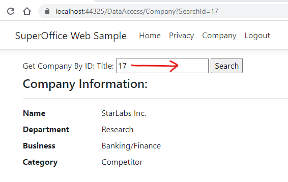

# SuperOffice Web Application Sample

This application demonstrates use the following nuget packages:

* [SuperOffice.WebApi](https://www.nuget.org/packages/SuperOffice.WebApi)
* [AspNet.Security.OAuth.SuperOffice](https://www.nuget.org/packages/AspNet.Security.OAuth.SuperOffice)

## How to run application

1) **Start the application** in Visual Studio, Visual Studio Code or dotnet run

2) **Client on the login link.**

   

3) **Click the SuperOffice button.**

   

4) **Login to SuperOffice Online.**
   - Follow the prompts...

5) **Observe the claims and tokens, then click on Company Link**

   

6) **Enter a known company id, then click the Search button.**
   - Observe the results (Name, Department, business and category) 

   
